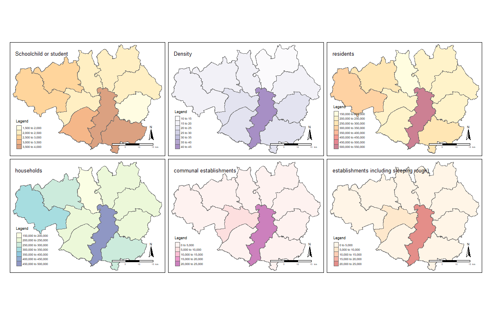

```{r}
library(tidyverse)
library(maptools)
library(RColorBrewer)
library(classInt)
library(OpenStreetMap)
library(sp)
library(rgeos)
library(tmap)
library(tmaptools)
library(sf)
library(rgdal)
library(geojsonio)
GMData <- read_csv('20181031154530654_EGRPDT_UNIT/Data_EGRPDT_UNIT.csv')
GMBorough <- read_shape("GMBoundaryData/england_ct_2011.shp", as.sf = TRUE)
BoroughDataMap <- append_data(GMBorough,GMData, key.shp = "code", key.data = "GEO_CODE", ignore.duplicates = TRUE)
tmap_mode("plot")
tm_shape(BoroughDataMap) +
    tm_polygons(c("Schoolchild_or_full-time_student_aged_4_and_over_at_their_non-term-time_address", "Density_(number_of_persons_per_Hectare)","All_usual_residents","All_usual_residents_in_households","All_usual_residents_in_communal_establishments","All_usual_residents_in_communal_establishments_(including_people_enumerated_as_sleeping_rough)"), 
        palette=list("YlOrBr", "Purples","YlOrRd","YlGnBu","RdPu","OrRd"),       
        auto.palette.mapping=FALSE,
        title="Legend",
        alpha = 0.5) + 
  tm_compass(position = c("right", "bottom"),type = "arrow") + 
  tm_scale_bar(position = c("right", "bottom")) +
  tm_layout(title =c("Schoolchild or student", "Density","residents","households","communal establishments","establishments including sleeping rough)"), legend.position = c("left", "bottom"))
```



```{r}
library(png)
library(grid)
image1 <- readPNG("D:/Data/OneDrive/UCL/Term1/CASA0005 Geographic Information Systems and Science/N/gis_code/gis_code/Rplot.png")
grid.raster(image1)
```


Words Count: 590

Explanation of two made maps:
Two maps were made by ArcGIS and R Studio respectively. Map1 illustrates the numbers of pubs(which is 190) within the area of 200 meters around the shortest route by walk from the Manchester Piccadilly station to the main building of the University of Manchester. The work flow is, downloaded the data form the UK census and attached them into ArcGIS at first. Then the network dataset had been set, and evaluated the shortest route from two points. At last buffered the line and selected out the pubs within this area.
Map2 demonstrated six different population related data of 10 regions in Greater Manchester. Each maps was filled in different colors, the deeper the color is, the higher the population density is.

Comparison between GUI-based GIS and code-based software:
GUI-based GIS and code-based software are two different kinds of software which are both used to make geo-spatial drawings. While they have many same and different particular features. ArcGIS and R will be taken as examples in this essay. 
Both of the ArcGIS and R have a data storing environment called “Geodatabase” and “RProject”, respectively. Therefore, a huge range of data formats, such as comma-separated values(csv) or shapefiles(shp), can be stored into them and used for different kinds of works in the same repository.
The two software possess similar functions in map making. However, they are different in a certain extent. For instance, it is concise of the way using R, which uses unique programming language called “R language” to control all the processes in order to make maps. On the other hand, as a result of a positive human interaction, the visualization user-interface is used in the ArcGIS, which makes it a user-friendly software. In other words, people who are not familiar with programming can also use it expertly.
Furthermore, comparing with the charging mode of the ArcGIS, R is an open source software which enables everyone to use and upload their own packages for other users. In contrast, ArcGIS was released by ESRI( Environmental Systems Research Institute), users need to pay for using. Although both of them have extensions(packages and toolbox), because of the open source mode of R, the standard of each package varies greatly. While in this case, the ESRI can handle the standard of the tools released on ArcGIS.
Moreover, R is more likely an object oriented programming software, which enable the users produce reproducible works. As a consequence of the code-based pattern, codes are used repeated in the same works. In fact, codes in a template work can be copied and edited into suitable ones for other users who might plot the same maps. In addition, users do not need to repeat their steps getting the similar works. That is to say, multiple maps can be plotted at once within simple codes. Comparing with R, the ArcGIS is totally different in this situation, it is more likely a process oriented software, users need to memorize the positions of functions which used to analyze the data when using it. As a result, the works can not be reproduced( except Model Builder), users need to re-execute the similar procedures to get other maps. In addition, if mistakes are found in the completed maps, it is hard to edit and correct them.
To sum up, both GUI-based GIS and code-based software can generate good maps, it is easy to make reproducible works by R. On the other side, ArcGIS is a more user-friendly one which can be used for complex but less repeated analyzes.


